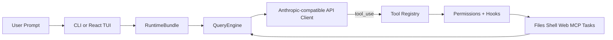

<h1 align="center">
  
  <br>
  <code>dy</code> — DaoYi Agent OS
</h1>

<p align="center">
  <a href="README.md"><strong>English</strong></a> ·
  <a href="README.zh-CN.md"><strong>简体中文</strong></a>
</p>

**DaoYi Agent OS** (formerly OpenHarness) delivers core lightweight agent infrastructure: intent-driven skill orchestration, tool-use, memory, and multi-agent coordination. Named after the Chinese concept "道易" — the path is simple.

Architecture: small model (Qwen3-2B local) pre-classifies intent → matches skills → lazy-loads `<available-skills>` block → remote LLM (Qwen3VL-8B) executes with read_skill + skill_executor tools. All 51 skills tiered (core/dev/ai/pro/lite), workspace-isolated via git worktree, no C++ compilation needed for development.

<p align="center">
  <a href="#-quick-start"></a>
  <a href="#-harness-architecture"></a>
  <a href="#-features"></a>
  <a href="#-test-results"></a>
  <a href="LICENSE"></a>
</p>

<p align="center">
  
  
  
  
  
  
</p>

**Architecture**: Local Qwen3-2B classifies intent → 51 tiered skills (core/dev/ai/pro/lite) → lazy `<available-skills>` injection → remote Qwen3VL-8B calls `read_skill` + `skill_executor`. Workspace isolation via git worktree. No C++ compilation needed for skill development.

<p align="center">
  
</p>

---
## ✨ DaoYi Agent OS Key Features

<table align="center" width="100%">
<tr>
<td width="20%" align="center" style="vertical-align: top; padding: 15px;">

<h3>🔄 Agent Loop</h3>

<div align="center">
  
</div>


<p align="center"><strong>• Streaming Tool-Call Cycle</strong></p>
<p align="center"><strong>• API Retry with Exponential Backoff</strong></p>
<p align="center"><strong>• Parallel Tool Execution</strong></p>
<p align="center"><strong>• Token Counting & Cost Tracking</strong></p>

</td>
<td width="20%" align="center" style="vertical-align: top; padding: 15px;">

<h3>🔧 Harness Toolkit</h3>

<div align="center">
  
</div>


<p align="center"><strong>• 43 Tools (File, Shell, Search, Web, MCP)</strong></p>
<p align="center"><strong>• On-Demand Skill Loading (.md)</strong></p>
<p align="center"><strong>• Plugin Ecosystem (Skills + Hooks + Agents)</strong></p>
<p align="center"><strong>• Compatible with anthropics/skills & plugins</strong></p>

</td>
<td width="20%" align="center" style="vertical-align: top; padding: 15px;">

<h3>🧠 Context & Memory</h3>

<div align="center">
  
</div>


<p align="center"><strong>• CLAUDE.md Discovery & Injection</strong></p>
<p align="center"><strong>• Context Compression (Auto-Compact)</strong></p>
<p align="center"><strong>• MEMORY.md Persistent Memory</strong></p>
<p align="center"><strong>• Session Resume & History</strong></p>

</td>
<td width="20%" align="center" style="vertical-align: top; padding: 15px;">

<h3>🛡️ Governance</h3>

<div align="center">
  
</div>


<p align="center"><strong>• Multi-Level Permission Modes</strong></p>
<p align="center"><strong>• Path-Level & Command Rules</strong></p>
<p align="center"><strong>• PreToolUse / PostToolUse Hooks</strong></p>
<p align="center"><strong>• Interactive Approval Dialogs</strong></p>

</td>
<td width="20%" align="center" style="vertical-align: top; padding: 15px;">

<h3>🤝 Swarm Coordination</h3>

<div align="center">
  
</div>


<p align="center"><strong>• Subagent Spawning & Delegation</strong></p>
<p align="center"><strong>• Team Registry & Task Management</strong></p>
<p align="center"><strong>• Background Task Lifecycle</strong></p>
<p align="center"><strong>• <a href="https://github.com/HKUDS/ClawTeam">ClawTeam</a> Integration (Roadmap)</strong></p>

</td>
</tr>
</table>

---

## 🤔 What is an Agent Harness?

An **Agent Harness** is the complete infrastructure that wraps around an LLM to make it a functional agent. The model provides intelligence; the harness provides **hands, eyes, memory, and safety boundaries**.

DaoYi adds a unique twist: a **local small model** (Qwen3-2B) pre-classifies user intent before the remote LLM sees anything — enabling tiered skill matching, continuation detection, and early "no capability" stop without ever hitting the network.

<p align="center">
  
</p>

DaoYi Agent OS is an open-source Python implementation designed for **researchers, builders, and the community**:

- **Understand** how production AI agents work under the hood
- **Experiment** with cutting-edge tools, skills, and agent coordination patterns
- **Extend** with custom plugins, providers, and domain knowledge
- **Build** specialized agents on top of proven architecture

---

## 📰 What's New

- **2026-05-29** 🧠 **PilotDeck P0-P3** — Skill lazy loading, continuation detection, tier prompts, workspace isolation:
  - `<available-skills>` block injects only name+desc+tier (~500 tokens saved per round)
  - "继续"/"go"/"然后呢" detected as continuation → inherits last intent (~30% fewer mis-classifications)
  - `git worktree` isolation for sandboxed tool execution with auto-cleanup
  - 51 skills organized into 5 tiers (core/dev/ai/pro/lite)
- **2026-05-27** 🔄 **Project rename OpenHarness → DaoYi Agent OS**:
  - CLI `oh` → `dy`, config `~/.openharness/` → `~/.daoyi/`, env vars `DAOYI_*` primary + `OPENHARNESS_*` backward compat
  - 310+ files renamed, package name `daoyi-agent-os` on PyPI
- **2026-05-27** 🎯 **Web search reliability** — wttr.in weather API fallback, Baidu CAPTCHA detection, DuckDuckGo then Bing chain
- **2026-05-25** 🤖 **Small model upgrade** — Qwen2.5-0.5B → Qwen3-2B-VL Q4_K_M; model thinking streamed to frontend
- **2026-04-18** ⚙️ **v0.1.7** — Packaging & TUI polish 

<p align="center">
  <strong>Start here:</strong>
  <a href="#-quick-start">Quick Start</a> ·
  <a href="#-provider-compatibility">Provider Compatibility</a> ·
  <a href="docs/SHOWCASE.md">Showcase</a> ·
  <a href="CONTRIBUTING.md">Contributing</a> ·
  <a href="CHANGELOG.md">Changelog</a>
</p>

---

## 🚀 Quick Start

### 1. Install

#### Linux / macOS / WSL

```bash
# Via pip
pip install daoyi-agent-os
```

#### Windows (Native)

```powershell
# Via pip
pip install daoyi-agent-os
```

### 2. Configure

```bash
dy setup    # interactive wizard — pick a provider, authenticate, done
```

Supports **Claude / OpenAI / Copilot / Codex / Moonshot(Kimi) / GLM / MiniMax / NVIDIA NIM** and any compatible endpoint.

### 3. Run

```bash
dy
```

<p align="center">
  
</p>

### Non-Interactive Mode (Pipes & Scripts)

```bash
# Single prompt → stdout
dy -p "Explain this codebase"

# JSON output for programmatic use
dy -p "List all functions in main.py" --output-format json

# Stream JSON events in real-time
dy -p "Fix the bug" --output-format stream-json
```

## 🔌 Provider Compatibility

DaoYi Agent OS treats providers as **workflows** backed by named profiles. In day-to-day use, prefer:

```bash
dy setup
dy provider list
dy provider use <profile>
```

### Built-in Workflows

| Workflow | What it is | Typical backends |
|----------|------------|------------------|
| **Anthropic-Compatible API** | Anthropic-style request format | Claude official, Kimi, GLM, MiniMax, internal Anthropic-compatible gateways |
| **Claude Subscription** | Claude CLI subscription bridge | Local `~/.claude/.credentials.json` |
| **OpenAI-Compatible API** | OpenAI-style request format | OpenAI official, OpenRouter, DashScope, DeepSeek, SiliconFlow, Groq, Ollama, GitHub Models |
| **Codex Subscription** | Codex CLI subscription bridge | Local `~/.codex/auth.json` |
| **GitHub Copilot** | Copilot OAuth workflow | GitHub Copilot device-flow login |

### Compatible API Families

#### Anthropic-Compatible API

Typical examples:

| Backend | Base URL | Example models |
|---------|----------|----------------|
| **Claude official** | `https://api.anthropic.com` | `claude-sonnet-4-6`, `claude-opus-4-6` |
| **Moonshot / Kimi** | `https://api.moonshot.cn/anthropic` | `kimi-k2.5` |
| **Zhipu / GLM** | custom Anthropic-compatible endpoint | `glm-4.5` |
| **MiniMax** | custom Anthropic-compatible endpoint | `minimax-m1` |

#### OpenAI-Compatible API

Any provider implementing the OpenAI `/v1/chat/completions` style API works:

| Backend | Base URL | Example models |
|---------|----------|----------------|
| **OpenAI** | `https://api.openai.com/v1` | `gpt-5.4`, `gpt-4.1` |
| **OpenRouter** | `https://openrouter.ai/api/v1` | provider-specific |
| **Alibaba DashScope** | `https://dashscope.aliyuncs.com/compatible-mode/v1` | `qwen3.5-flash`, `qwen3-max`, `deepseek-r1` |
| **DeepSeek** | `https://api.deepseek.com` | `deepseek-chat`, `deepseek-reasoner` |
| **GitHub Models** | `https://models.inference.ai.azure.com` | `gpt-4o`, `Meta-Llama-3.1-405B-Instruct` |
| **SiliconFlow** | `https://api.siliconflow.cn/v1` | `deepseek-ai/DeepSeek-V3` |
| **NVIDIA NIM** | `https://integrate.api.nvidia.com/v1` | `openai/gpt-oss-120b`, `nvidia/llama-3.3-nemotron-super-49b-v1` |
| **Google Gemini** | `https://generativelanguage.googleapis.com/v1beta/openai` | `gemini-2.5-flash`, `gemini-2.5-pro` |
| **Groq** | `https://api.groq.com/openai/v1` | `llama-3.3-70b-versatile` |
| **Ollama (local)** | `http://localhost:11434/v1` | any local model |

### Advanced Profile Management

```bash
# List saved workflows
oh provider list

# Switch the active workflow
oh provider use codex

# Add your own compatible endpoint
oh provider add my-endpoint \
  --label "My Endpoint" \
  --provider openai \
  --api-format openai \
  --auth-source openai_api_key \
  --model my-model \
  --base-url https://example.com/v1
```

For custom compatible endpoints, OpenHarness can bind credentials per profile instead of forcing every Anthropic-compatible or OpenAI-compatible backend to share the same API key.

### Ollama (Local Models)

Run local models through Ollama's OpenAI-compatible endpoint:

```bash
# Add an Ollama provider profile
oh provider add ollama \
  --label "Ollama" \
  --provider Ollama \
  --api-format openai \
  --auth-source openai_api_key \
  --model glm-4.7-flash:q8_0 \
  --base-url http://localhost:11434/v1
```
```
Saved provider profile: ollama
```

```bash
# Activate and verify
oh provider use ollama
```
```
Activated provider profile: ollama
```

```bash
oh provider list
```
```
  claude-api: Anthropic-Compatible API [ready]
  ...
  moonshot: Moonshot (Kimi) [missing auth]
    auth=moonshot_api_key model=kimi-k2.5 base_url=https://api.moonshot.cn/v1
* ollama: Ollama [ready]
    auth=openai_api_key model=glm-4.7-flash:q8_0 base_url=http://localhost:11434/v1
```

### GitHub Copilot Format (`--api-format copilot`)

Use your existing GitHub Copilot subscription as the LLM backend. Authentication uses GitHub's OAuth device flow — no API keys needed.

```bash
# One-time login (opens browser for GitHub authorization)
oh auth copilot-login

# Then launch with Copilot as the provider
uv run oh --api-format copilot

# Or via environment variable
export DAOYI_API_FORMAT=copilot
uv run oh

# Check auth status
oh auth status

# Remove stored credentials
oh auth copilot-logout
```

| Feature | Details |
|---------|---------|
| **Auth method** | GitHub OAuth device flow (no API key needed) |
| **Token management** | Automatic refresh of short-lived session tokens |
| **Enterprise** | Supports GitHub Enterprise via `--github-domain` flag |
| **Models** | Uses Copilot's default model selection |
| **API** | OpenAI-compatible chat completions under the hood |

---

## 🏗️ DaoYi Agent OS Architecture

Two-stage architecture: **small model (local)** classifies intent → **large model (remote)** executes.

```
┌─────────────────────────────────────────────────────┐
│ pre_classify()                                      │
│  ├─ Short continuation? → inherit last intent       │
│  ├─ SmallModel (Qwen3-2B Q4_K_M) → 6 categories     │
│  ├─ RuleClassifier (Python regex)                   │
│  └─ C++ Classifier (fallback)                       │
├─────────────────────────────────────────────────────┤
│ SkillMatcher → top-5 skills by intent               │
│ SkillContextInjector → <available-skills> block     │
│   format: name + one-line desc + [tier]             │
├─────────────────────────────────────────────────────┤
│ LLM (Qwen3VL-8B remote or C++ local)                │
│  ├─ reads <available-skills> → calls read_skill     │
│  ├─ reads full commands → calls skill_executor      │
│  ├─ or calls built-in tools (bash, read, write...)  │
│  └─ ThinkingDelta streamed to frontend              │
├─────────────────────────────────────────────────────┤
│ WorkspaceProvider (P3)                              │
│  ├─ GitWorktreeProvider (fast, shared objects)      │
│  └─ SnapshotCopyProvider (rsync fallback)            │
└─────────────────────────────────────────────────────┘
```

### Key Subsystems

```
daoyi/
  task_workflow/   # 🧠 Agent Loop + Skill orchestration
  tools/           # 🔧 41 Tools — file I/O, shell, search, web, MCP
  skills/          # 📚 Knowledge — 51 tiered skills (core/dev/ai/pro/lite)
  plugins/         # 🔌 Extensions — commands, hooks, agents, MCP servers
  permissions/     # 🛡️ Safety — multi-level modes, path rules, command deny
  hooks/           # ⚡ Lifecycle — PreToolUse/PostToolUse event hooks
  commands/        # 💬 Commands — /help, /commit, /plan, /resume, ...
  mcp/             # 🌐 MCP — Model Context Protocol client
  memory/          # 🧠 Memory — persistent cross-session knowledge
  tasks/           # 📋 Tasks — background task management
  coordinator/     # 🤝 Multi-Agent — subagent spawning, team coordination
  config/          # ⚙️ Settings — multi-layer config, env var fallback
  ui/              # 🖥️ React TUI — backend protocol + frontend
  sandbox/         # 🏝️ Workspace isolation — git worktree, snapshot copy
```
daoyi/
  engine/          # 🧠 Agent Loop — query → stream → tool-call → loop
  tools/           # 🔧 43 Tools — file I/O, shell, search, web, MCP
  skills/          # 📚 Knowledge — on-demand skill loading (.md files)
  plugins/         # 🔌 Extensions — commands, hooks, agents, MCP servers
  permissions/     # 🛡️ Safety — multi-level modes, path rules, command deny
  hooks/           # ⚡ Lifecycle — PreToolUse/PostToolUse event hooks
  commands/        # 💬 54 Commands — /help, /commit, /plan, /resume, ...
  mcp/             # 🌐 MCP — Model Context Protocol client
  memory/          # 🧠 Memory — persistent cross-session knowledge
  tasks/           # 📋 Tasks — background task management
  coordinator/     # 🤝 Multi-Agent — subagent spawning, team coordination
  prompts/         # 📝 Context — system prompt assembly, CLAUDE.md, skills
  config/          # ⚙️ Settings — multi-layer config, migrations
  ui/              # 🖥️ React TUI — backend protocol + frontend
```

### The Agent Loop

The heart of the harness. One loop, endlessly composable:

```python
while True:
    response = await api.stream(messages, tools)
    
    if response.stop_reason != "tool_use":
        break  # Model is done
    
    for tool_call in response.tool_uses:
        # Permission check → Hook → Execute → Hook → Result
        result = await harness.execute_tool(tool_call)
    
    messages.append(tool_results)
    # Loop continues — model sees results, decides next action
```

The model decides **what** to do. The harness handles **how** — safely, efficiently, with full observability.

### Harness Flow



---

## ✨ Features

### 🔧 Tools (41)

| Category | Tools | Description |
|----------|-------|-------------|
| **File I/O** | Bash, Read, Write, Edit, Glob, Grep | Core file operations with permission checks |
| **Search** | WebFetch, WebSearch, ToolSearch, LSP | Web and code search capabilities |
| **Notebook** | NotebookEdit | Jupyter notebook cell editing |
| **Agent** | Agent, SendMessage, TeamCreate/Delete | Subagent spawning and coordination |
| **Task** | TaskCreate/Get/List/Update/Stop/Output | Background task management |
| **Skill** | SkillExecutor, ReadSkill, Skill | Dynamic skill loading and execution |
| **MCP** | MCPTool, ListMcpResources, ReadMcpResource | Model Context Protocol integration |
| **Mode** | EnterPlanMode, ExitPlanMode, Worktree | Workflow mode switching |
| **Schedule** | CronCreate/List/Delete, RemoteTrigger | Scheduled and remote execution |
| **Meta** | Config, Brief, Sleep, AskUser | Configuration and interaction |

Every tool has:
- **Pydantic input validation** — structured, type-safe inputs
- **Self-describing JSON Schema** — models understand tools automatically
- **Permission integration** — checked before every execution
- **Hook support** — PreToolUse/PostToolUse lifecycle events

### 📚 Skills System (51 tiered skills)

Skills are **lazy-loaded** via `<available-skills>` block — only names, one-line descriptions, and tiers are injected into context (~500 tokens saved per round). The LLM calls `read_skill` to load full command details on demand.

Five tiers:

| Tier | Description | Example skills |
|------|-------------|----------------|
| **core** | Built-in, always available | bash, read, write, edit, glob, grep |
| **dev** | Development workflows | commit, review, test, debug, plan |
| **ai** | AI/ML | pytorch, tensorflow, huggingface, onnx |
| **pro** | Professional tools | gimp, blender, shotcut, sox, imagemagick |
| **lite** | Lightweight utilities | pdf, xlsx, csvkit, yq, jq |

Skills are discovered from:

```text
~/.daoyi/skills/<skill>/SKILL.md      # User-level
~/.claude/skills/<skill>/SKILL.md      # Claude compat
~/.agents/skills/<skill>/SKILL.md      # Agent compat
<project>/.daoyi/skills/<skill>/SKILL.md  # Project-level
```

Compatible with [anthropics/skills](https://github.com/anthropics/skills).

### 🌐 Web search and proxy settings

Built-in `web_search` uses Baidu + DuckDuckGo + Bing chain. For weather queries, it first tries `wttr.in` (no API key needed, supports 40+ Chinese city names). Custom endpoints also supported:

```bash
export DAOYI_WEB_SEARCH_URL="https://your-searxng.example/search"
```

For proxy (SSRF-safe, `trust_env=False` by default):

```bash
export DAOYI_WEB_PROXY="http://127.0.0.1:7890"
```

Backward compatibility: `OPENHARNESS_WEB_SEARCH_URL` and `OPENHARNESS_WEB_PROXY` also work as fallbacks.

The proxy URL must be HTTP/HTTPS and cannot contain embedded credentials.

### 🔌 Plugin System

**Compatible with [claude-code plugins](https://github.com/anthropics/claude-code/tree/main/plugins)**. Tested with 12 official plugins:

| Plugin | Type | What it does |
|--------|------|-------------|
| `commit-commands` | Commands | Git commit, push, PR workflows |
| `security-guidance` | Hooks | Security warnings on file edits |
| `hookify` | Commands + Agents | Create custom behavior hooks |
| `feature-dev` | Commands | Feature development workflow |
| `code-review` | Agents | Multi-agent PR review |
| `pr-review-toolkit` | Agents | Specialized PR review agents |

```bash
# Manage plugins
oh plugin list
oh plugin install <source>
oh plugin enable <name>
```

### 🤝 Ecosystem Workflows

OpenHarness is useful as a lightweight harness layer around Claude-style tooling conventions:

- **OpenClaw-oriented workflows** can reuse Markdown-first knowledge and command-driven collaboration patterns.
- **Claude-style plugins and skills** stay portable because OpenHarness keeps those formats familiar.
- **ClawTeam-style multi-agent work** maps well onto the built-in team, task, and background execution primitives.

For concrete usage ideas instead of generic claims, see [`docs/SHOWCASE.md`](docs/SHOWCASE.md).

### 🛡️ Permissions

Multi-level safety with fine-grained control:

| Mode | Behavior | Use Case |
|------|----------|----------|
| **Default** | Ask before write/execute | Daily development |
| **Auto** | Allow everything | Sandboxed environments (workspace isolation) |
| **Plan Mode** | Block all writes | Large refactors, review first |

**Path-level rules** in `settings.json`:
```json
{
  "permission": {
    "mode": "default",
    "path_rules": [{"pattern": "/etc/*", "allow": false}],
    "denied_commands": ["rm -rf /", "DROP TABLE *"]
  }
}
```

### 🖥️ Terminal UI

React/Ink TUI with full interactive experience:

- **Command picker**: Type `/` → arrow keys to select → Enter
- **Permission dialog**: Interactive y/n with tool details
- **Mode switcher**: `/permissions` → select from list
- **Session resume**: `/resume` → pick from history
- **Animated spinner**: Real-time feedback during tool execution
- **Keyboard shortcuts**: Shown at the bottom, context-aware

### 📡 CLI

```
dy [OPTIONS] COMMAND [ARGS]

Session:     -c/--continue, -r/--resume, -n/--name
Model:       -m/--model, --effort, --max-turns
Output:      -p/--print, --output-format text|json|stream-json
Permissions: --permission-mode, --dangerously-skip-permissions
Context:     -s/--system-prompt, --append-system-prompt, --settings
Advanced:    -d/--debug, --mcp-config, --bare

Subcommands: dy setup | dy provider | dy auth | dy mcp | dy plugin
```

### 🙋 Small Model Intelligence

Local Qwen3-2B-VL-Instruct Q4_K_M (1GB) handles pre-classification:

- **6 categories**: code, tool, search, chat, plan, question
- **Continuation detection**: "继续"/"go"/"然后呢" → inherits last intent
- **Tier-aware**: classification prompt includes difficulty tier rules
- **3-stage pipeline**: continuation check → SmallModel → RuleClassifier → C++ fallback

### 🏝️ Workspace Isolation

Tools execute in isolated workspaces via `git worktree` (git repos) or `SnapshotCopyProvider` (rsync/copytree). Auto-created on `execute()` start, auto-cleaned on finish.

---

## 📊 Test Results

```bash
# Full suite
uv run pytest -q             # 1161 passed, 11 skipped, 21 warnings in ~27s
uv run pytest tests/ -x -q   # Fast failure mode
```

Test breakdown: 51 tool tests, 24 task_workflow tests, 57 UI tests, 41+ API/engine/memory/compact/swarm/commands tests.

---

## 🔧 Extending DaoYi Agent OS

### Add a Custom Tool

```python
from pydantic import BaseModel, Field
from daoyi.tools.base import BaseTool, ToolExecutionContext, ToolResult

class MyToolInput(BaseModel):
    query: str = Field(description="Search query")

class MyTool(BaseTool):
    name = "my_tool"
    description = "Does something useful"
    input_model = MyToolInput

    async def execute(self, arguments: MyToolInput, context: ToolExecutionContext) -> ToolResult:
        return ToolResult(output=f"Result for: {arguments.query}")
```

### Add a Custom Skill

Create `~/.daoyi/skills/my-skill.md`:

```markdown
---
name: my-skill
description: Expert guidance for my specific domain
---

# My Skill

## When to use
Use when the user asks about [your domain].

## Workflow
1. Step one
2. Step two
...
```

### Add a Plugin

Create `.daoyi/plugins/my-plugin/.claude-plugin/plugin.json`:

```json
{
  "name": "my-plugin",
  "version": "1.0.0",
  "description": "My custom plugin"
}
```

Add commands in `commands/*.md`, hooks in `hooks/hooks.json`, agents in `agents/*.md`.

---

## 🌍 Showcase

DaoYi Agent OS is most useful when treated as a small, inspectable harness you can adapt to a real workflow:

- **Repo coding assistant** for reading code, patching files, and running checks locally.
- **Headless scripting tool** for `json` and `stream-json` output in automation flows.
- **Plugin and skill testbed** for experimenting with Claude-style extensions.
- **Multi-agent prototype harness** for task delegation and background execution.
- **Provider comparison sandbox** across Anthropic-compatible backends.

See [`docs/SHOWCASE.md`](docs/SHOWCASE.md) for short, reproducible examples.

---

## 🤝 Contributing

DaoYi Agent OS is a **community-driven research project**. We welcome contributions in:

| Area | Examples |
|------|---------|
| **Tools** | New tool implementations for specific domains |
| **Skills** | Domain knowledge `.md` files (finance, science, DevOps...) |
| **Plugins** | Workflow plugins with commands, hooks, agents |
| **Providers** | Support for more LLM backends (OpenAI, Ollama, etc.) |
| **Multi-Agent** | Coordination protocols, team patterns |
| **Testing** | E2E scenarios, edge cases, benchmarks |
| **Documentation** | Architecture guides, tutorials, translations |

```bash
# Development setup
git clone <repo-url>
cd daoyi
uv sync --extra dev
uv run pytest -q  # Verify everything works
```

Useful contributor entry points:

- [`CONTRIBUTING.md`](CONTRIBUTING.md) for setup, checks, and PR expectations
- [`CHANGELOG.md`](CHANGELOG.md) for user-visible changes
- [`docs/SHOWCASE.md`](docs/SHOWCASE.md) for real-world usage patterns worth documenting

---

## 🔧 Troubleshooting

### Backspace key in macOS Terminal.app

DaoYi Agent OS handles both common terminal delete sequences, including the raw `DEL` byte (`0x7f`) that macOS Terminal.app sends for Backspace. If Backspace inserts spaces or visible control characters instead of deleting text, upgrade first.

---

## 📄 License

MIT — see [LICENSE](LICENSE).

---

<p align="center">
  
  <br>
  <strong>道易 — The path is simple.</strong>
  <br>
  <em>Small model decides. Large model acts.</em>
</p>
